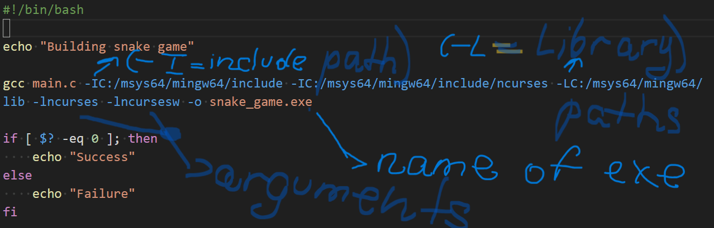

# Snake Game

A simple snake game implemented in C using the ncurses library.

## Introduction

This project is a classic snake game where the player controls a snake to collect berries on the screen. Each berry collected increases the length of the snake. The game is implemented in C and uses the ncurses library for handling the console interface.

## Features

- Snake movement and growth
- Berry collection
- Score display
- Screen boundaries wrapping
- Simple keyboard controls
- Game restart and exit options

## Installation

### Prerequisites

Make sure you have the following installed on your system:

- gcc (GNU Compiler Collection)
- ncurses library

You can install the ncurses library using the following commands:

For Debian/Ubuntu-based distributions:

```bash
sudo apt-get install libncurses5-dev libncursesw5-dev
```

For RedHat/CentOS-based distributions:

```bash
sudo yum install ncurses-devel
```

For MSYS2 (on Windows):

1. Open the MSYS2 shell.
2. Update the package database and install the ncurses library:

```bash
pacman -Syu
pacman -S mingw-w64-x86_64-ncurses
```

# Building the Project

1. Clone the repository:

```bash
https://github.com/IOleg-crypto/snake_game_c.git
cd snake_game_c
```

2. Compile the project:


Don`t forget update paths in shell script to complie program

```bash
./build.sh
```

# Usage

```bash
start snake_game.exe
```

# Controls

- Arrow keys or W, A, S, D: Move the snake up, left, down, and right
- Q: Restart the game
- E: Exit the game
